# 🩺 Pneumonia Chest X-Ray Classification Using Deep Learning

[](https://www.python.org/)
[](https://tensorflow.org/)
[](https://keras.io/)
[](https://arxiv.org/abs/1801.04381)
[-95.13%25-success.svg)](#benchmark-results)
[](#benchmark-results)
[](https://gradio.app/)
[](LICENSE)

An end-to-end Deep Learning system and clinical screening assistant for identifying **Pneumonia** from anterior-posterior (AP/PA) chest radiographs. Built with **MobileNetV2** transfer learning, robust data augmentation, inverse class-weight balancing, and deployed with a **Gradio** web application and CLI inference suite.

---

## 📌 Table of Contents
- [Project Overview](#-project-overview)
- [Key Performance Benchmarks](#-key-performance-benchmarks)
- [Model Architecture & Pipeline](#-model-architecture--pipeline)
- [Repository Structure](#-repository-structure)
- [Quickstart & Installation](#-quickstart--installation)
  - [Option A: Python Virtual Environment (venv)](#option-a-python-virtual-environment-recommended)
  - [Option B: Conda Environment](#option-b-conda-environment)
- [How to Run](#-how-to-run)
  - [1. Launch Interactive Gradio Web App](#1-launch-interactive-gradio-web-app)
  - [2. CLI Single-Image Prediction](#2-cli-single-image-prediction)
  - [3. Interactive Jupyter Notebook](#3-interactive-jupyter-notebook)
- [Dataset Details & Setup](#-dataset-details--setup)
- [How to Push to GitHub](#-how-to-push-to-github)
- [Medical Disclaimer](#-medical-disclaimer)
- [License](#-license)

---

## 🔬 Project Overview

Pneumonia is an acute inflammatory infection of the pulmonary parenchyma caused by bacteria, viruses, or fungi. It accounts for substantial global morbidity and mortality, particularly among young children and elderly demographics. Diagnosing pneumonia from chest radiographs requires specialized radiological expertise and can be bottlenecked by clinician availability in resource-constrained environments.

This project delivers:
- **High-Sensitivity Classifier**: Prioritizes minimizing False Negatives (**95.13% recall** on unseen radiographs).
- **Lightweight Backbone**: Employs pre-trained **MobileNetV2** (2.4M parameters, ~11.6 MB) suitable for edge and point-of-care deployment.
- **Production-Ready Artifacts**: Includes an interactive Gradio web application (`app.py`), a CLI tool (`predict.py`), automated CI workflows, and a full exploratory research notebook.

---

## 📊 Key Performance Benchmarks

Evaluated on the untouched **624-image unseen test set** (234 Normal, 390 Pneumonia):

| Metric | Score | Clinical Interpretation |
| :--- | :--- | :--- |
| **Sensitivity / Recall (Pneumonia)** | **95.13%** | Identifies **371 out of 390** actual pneumonia cases, minimizing missed diagnoses. |
| **ROC-AUC** | **0.9247** | Demonstrates strong discriminative power across varying decision thresholds. |
| **Pneumonia F1-Score** | **0.8750** | Harmonic mean reflecting balanced precision and sensitivity. |
| **Overall Test Accuracy** | **83.01%** | Consistent across diverse pediatric radiographic profiles. |
| **Pneumonia Precision** | **81.00%** | When flagging pneumonia, 81% are true bacterial/viral cases. |
| **Normal Precision** | **88.55%** | High specificity when verifying healthy lung parenchyma. |

### Confusion Matrix Breakdown (Test Set)

```
                       PREDICTED NORMAL    PREDICTED PNEUMONIA
ACTUAL NORMAL (234)          147 (TN)            87 (FP)
ACTUAL PNEUMONIA (390)        19 (FN)           371 (TP)
```

> **Clinical Design Note**: In medical screening algorithms, False Negatives (missing a patient with active pneumonia) carry severe health risks. The model’s loss function incorporates inverse class weighting to penalize missed positive cases, resulting in a low false-negative rate (**19 out of 390 cases, 4.87%**).

---

## 🧠 Model Architecture & Pipeline

```mermaid
graph LR
    A["Raw X-Ray Image"] --> B["Preprocessing: Resize 224x224 & Normalize"]
    B --> C["Data Augmentation: Flip, Rotation, Zoom, Contrast"]
    C --> D["MobileNetV2 Backbone (ImageNet Pre-trained)"]
    D --> E["Global Average Pooling 2D"]
    E --> F["Batch Normalization"]
    F --> G["Dense (256, ReLU, L2 Regularization)"]
    G --> H["Dropout (0.4)"]
    H --> I["Dense (1, Sigmoid)"]
    I --> J["P(Pneumonia) [0.0 - 1.0]"]
```



### Technical Specifications:
- **Input Resolution**: `224 × 224 × 3` RGB
- **Feature Extractor**: `MobileNetV2` (weights pre-trained on ImageNet)
- **Total Parameters**: 2,427,201 (166,657 trainable in classification head)
- **Loss Function**: Binary Crossentropy with Class Weight Balancing:
  - Normal Class Weight: `~2.18`
  - Pneumonia Class Weight: `~0.76`
- **Optimizer**: Adam ($\text{learning rate} = 1\times 10^{-4}$)
- **Callbacks**:
  - `ModelCheckpoint`: Preserves weights achieving peak `val_auc`.
  - `EarlyStopping`: Prevents overfitting (`patience=5`, restores best weights).
  - `ReduceLROnPlateau`: Halves learning rate when validation loss plateaus.

---

## 📁 Repository Structure

```text
chest_xray/
├── .github/
│   └── workflows/
│       └── ci.yml                 # Automated CI syntax & lint workflow
├── .env.example                   # Environment configuration template
├── .gitattributes                 # Line ending normalization & Git LFS setup
├── .gitignore                      # Python, dataset, and cache ignore rules
├── app.py                         # Standalone Gradio web application
├── best_pneumonia_model.keras     # Checkpointed optimal model weights (11.6 MB)
├── CONTRIBUTING.md                # Contribution guidelines & standards
├── environment.yml                # Conda environment specification
├── LICENSE                        # MIT Open Source License
├── pneumonia_chest_xray_classification.ipynb  # End-to-end research notebook
├── predict.py                     # CLI single-image prediction utility
├── README.md                      # Comprehensive project documentation
└── requirements.txt               # Pip dependency specification
```

---

## 🚀 Quickstart & Installation

### Prerequisites
- Python `3.10` or higher
- Git

### Clone the Repository
```bash
git clone https://github.com/<your-username>/chest-xray-pneumonia.git
cd chest-xray-pneumonia
```

### Option A: Python Virtual Environment (Recommended)

```bash
# Create virtual environment
python -m venv .venv

# Activate on Windows (PowerShell)
.venv\Scripts\Activate.ps1

# Activate on Linux / macOS
source .venv/bin/activate

# Install dependencies
pip install --upgrade pip
pip install -r requirements.txt
```

### Option B: Conda Environment

```bash
conda env create -f environment.yml
conda activate chest-xray-pneumonia
```

---

## 💻 How to Run

### 1. Launch Interactive Gradio Web App

Start the localhost web application for real-time radiograph screening:

```bash
python app.py
```

- Open your browser to: **`http://127.0.0.1:7860`**
- Drag and drop any chest X-ray image (JPEG/PNG) or select one of the built-in benchmark examples.
- Click **Run AI Diagnostic Screening** to receive class probabilities, predicted diagnosis, and confidence scores.

### 2. CLI Single-Image Prediction

Run inference from your terminal on any chest radiograph:

```bash
# Standard formatted output
python predict.py --image test/PNEUMONIA/person1_virus_6.jpeg

# Output raw JSON (ideal for backend integration)
python predict.py --image test/NORMAL/IM-0001-0001.jpeg --json
```

**Sample CLI Output:**
```text
============================================================
     🩺 CHEST X-RAY CLASSIFICATION RESULT
============================================================
  Input File         : test/PNEUMONIA/person1_virus_6.jpeg
  Diagnostic Result  : PNEUMONIA
  Confidence         : 99.82%
  P(PNEUMONIA)       : 99.82%
  P(NORMAL)          : 0.18%
  Latency            : 45.2 ms
============================================================
  ⚠️ Positive indicator for Pneumonia. Further clinical review recommended.
============================================================
```

### 3. Interactive Jupyter Notebook

Explore the full pipeline, EDA, data preparation, training curves, confusion matrix, and classification report:

```bash
jupyter lab pneumonia_chest_xray_classification.ipynb
```

---

## 📦 Dataset Details & Setup

This model was trained on the benchmark **Chest X-Ray Images (Pneumonia)** dataset by Kermany et al.:
- **Total Images**: 5,856 pediatric chest radiographs
- **Classes**: `NORMAL` and `PNEUMONIA` (Bacterial and Viral)
- **Directory Splits**: `train/`, `val/`, `test/`

### Download Instructions

Because the raw dataset is ~1.2 GB, it is excluded from Git tracking via `.gitignore`. You can download it directly from Kaggle:

1. **Via Kaggle CLI**:
   ```bash
   pip install kaggle
   kaggle datasets download -d paultimothymooney/chest-xray-pneumonia
   unzip chest-xray-pneumonia.zip -d .
   ```
2. **Via Web Browser**:
   Download directly from [Kaggle Chest X-Ray Images (Pneumonia)](https://www.kaggle.com/datasets/paultimothymooney/chest-xray-pneumonia) and extract the `train/`, `val/`, and `test/` folders into the repository root.

---

## 📤 How to Push to GitHub

Follow these steps to initialize Git and push this repository to GitHub:

```bash
# 1. Initialize Git repository
git init

# 2. Stage all repository files (.gitignore will safely exclude the 1.2GB dataset)
git add .

# 3. Verify staged files (ensure best_pneumonia_model.keras, app.py, README.md are staged)
git status

# 4. Create initial commit
git commit -m "feat: initial commit with model, Gradio app, CLI, and docs"

# 5. Set default branch to main
git branch -M main

# 6. Add your GitHub remote repository URL
git remote add origin https://github.com/<YOUR_GITHUB_USERNAME>/<YOUR_REPOSITORY_NAME>.git

# 7. Push to GitHub
git push -u origin main
```

---

## ⚖️ Medical Disclaimer

> [!WARNING]
> **Not for Clinical Diagnosis**:
> This software and associated deep learning models are developed strictly for **academic research, educational demonstrations, and technical benchmarking**. 
> - This software has **not** been cleared or approved by the FDA, CE, or any regulatory medical device authority.
> - It does **not** provide definitive medical advice or establish a patient-physician relationship.
> - Diagnostic decisions must always be made by a licensed healthcare professional or board-certified radiologist in conjunction with comprehensive clinical symptoms and lab findings.

---

## 📜 License

Distributed under the **MIT License**. See [`LICENSE`](LICENSE) for complete terms.
